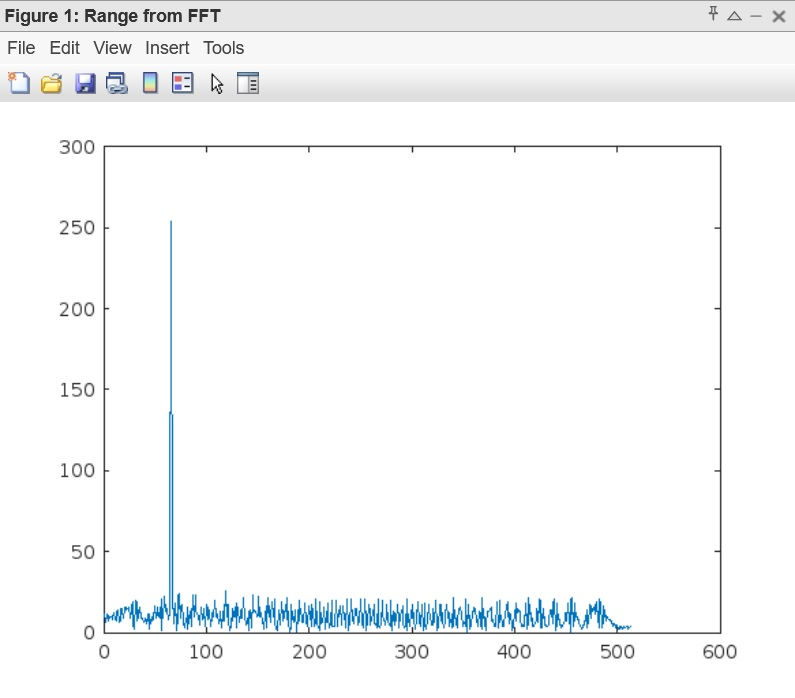
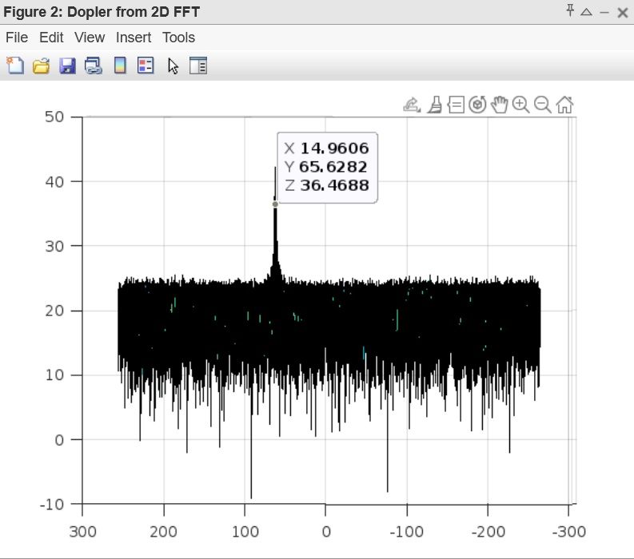
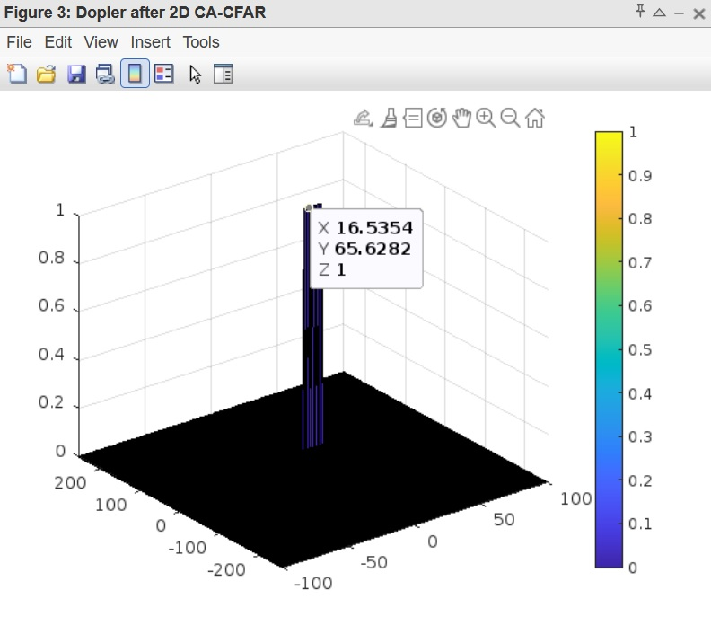

# RADAR target detection using CFAR
### (based on [Sensor Fusion Nanodegree Program](https://www.udacity.com/course/sensor-fusion-engineer-nanodegree--nd313))

## Overview

The current Matlab program implements the object detection algorithm through the following steps:
* Sets the RADAR system requirements

* Simulates the moving target by generating and propagating the signal;
* Deploys 1D Fast Fourier Transform (FFT) algorithm to convert the signal from time to frequency domain;

* Generates a Range Doppler Map using 2D FFT;

* Filters out the clutter for successful detection of the target using Constant False Alarm Rate (CFAR) technique:
  * Obtains a signal array 'signal' after applying 2D FFT;
  * Sets training and guard cells numbers:
      for range dimension 8 train cells and 4 guard cells were chosen;
      for dopler dimension 6 train cells and 2 guard cells were chosen;
  * Selects the offset (7 was chosen as it showed optimal results in filtering);
  * Creates a resulting zero-filled array 'result' with size of the 'signal';
  * Loops through the 'signal' in both dimensions and calculates the threshold (mean level of signal of the surrounding test cells);
  * Adds the offset to the threshold;
  * If 'signal' is higher than the threshold in the cell-under-test, sets appropriate cell in 'result' to 1;
 
  

## Basic Build Instructions

* Open the _./src/Radar_target_detection.m_ file in Matlab. Either use the local installation or its [online version](https://matlab.mathworks.com/). 
You will need to create a [Matlab account](https://www.mathworks.com/mwaccount/register) for that;
* Run the code;
